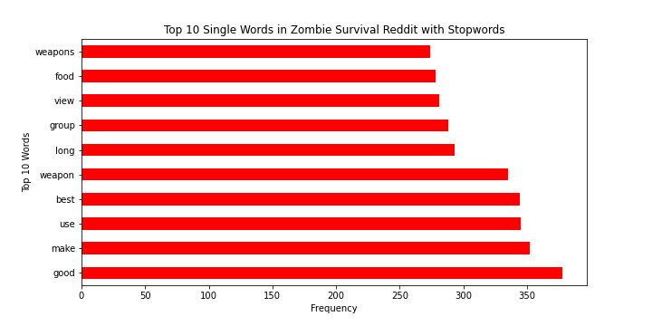
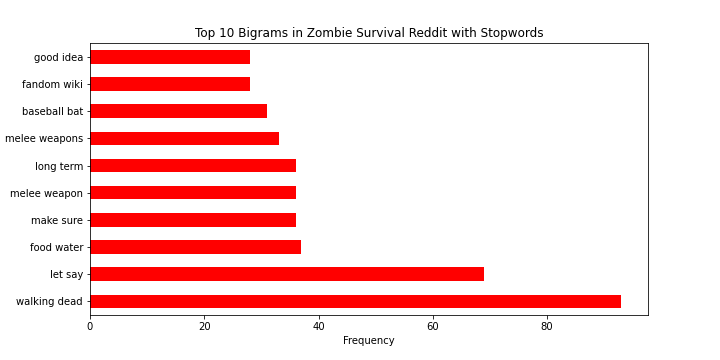
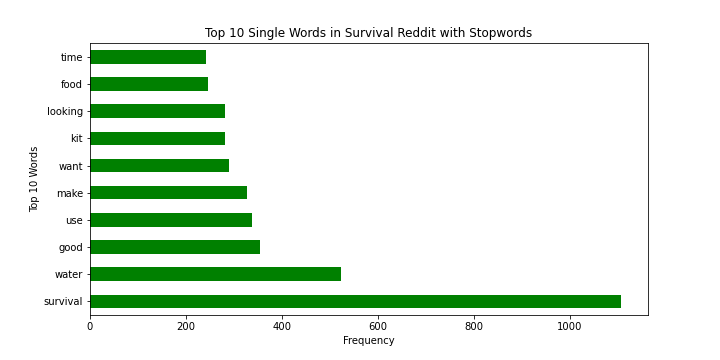
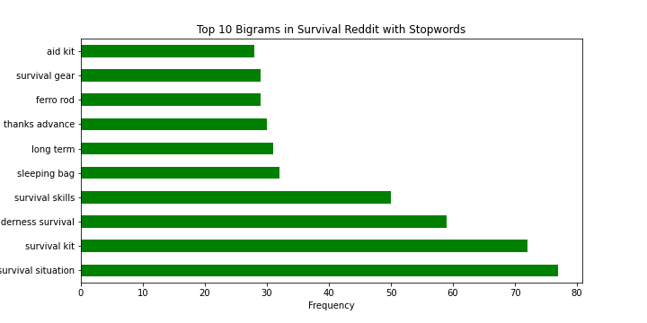
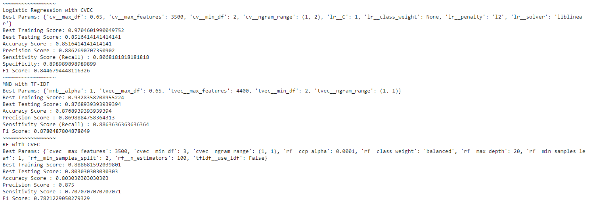
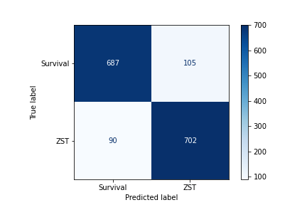
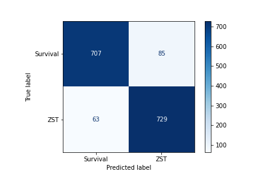

#  Project 3: Identifying Wilderness vs Zombie Survival Subreddits using API & NLP

## By: Leticia Genao

### Problem Statement
A popular forum social media, Reddit is a site where people can share posts, creates polls, and vote on good or bad posts by up and down voting them. Centered around sharing opinions, seeking advice, and engaging in discourse in specified subreddits on topics Reddit is a useful site to learn about people's thoughts regarding a news, products, shows, and other topics. This project aims to develop classification models that can correctly specify which of two subreddits a post originated from based on the title and description of the post. The subreddit of choice are "Survival"(1,645,218 subscribers) which provides wilderness survival tips, and "Zombie Survival Tactics"(22,004 subscribers) which provide advice if there were ever a zombie apocalypse. This project aims to discover useful insights for the movie and television production market to see what survivalists and preppers discuss or desire.

### Background Info/Outside Research:
3.7 million Americans classify themselves as survivalists and list some of their biggest concerns as economic collapse, grid failure, natural disasters, and terrorist attack. This community prepares for the worst with reddit as place they turn to for advice and podcasts like "The Survival Podcast", "The Survival Show", "The Survivalist Prepper Podcast" and shows like DoomsDay Preppers. A portion of these survivalists, approximately 14% according to a poll ran by You Gov, have a zombie survival plan prepared. 24% of these survivalists are Millennials, 15% being Generation X, and 6% being Boomers.

According to Allied Market Research the "emergency management" industry, which the survivalist market falls under, is valued at $107 billion dollars. Needless to say, there is a huge opportunity to appeal to and cash in on.

### Project/Data Information

- **Rows** 4800
- **Columns**10
- **Model Type** Binary Classification
- **Data Source** https://www.reddit.com/r/Survival/, https://www.reddit.com/r/ZombieSurvivalTactics/|

### Data Dictionary
Below is a data dictionary explaining the features used in my project.

|Feature|Type|Dataset|Description|
|---|---|---|---|
|**num_comments**|*int64*|combined_db| the number of comments on the post|
|**author**|*obj*|combined_db| the name of the user who posted the post|
|**created_utc**|*int64*|combined_db| the time of the post|
|**dummy coded subreddit**|*int64*|combined_db| binary column identifying subreddit|
|**selftext**|*obj*|combined_db|the description or selftext of the reddit post|
|**title**|*obj*|combined_db|the title of the reddit post|
|**timestamp**|*obj*|combined_db| the converted time of the post|
|**all_text**|*obj*|combined_db| the title and self text of the subreddit|

#### Top 10 Single Words in Zombie Survival Reddit with Stopwords

 "Make", "use", "weapon", "best" seem to indicate those in the ZST (Zombie Survival Tactics Reddit) use language revolving inquiring about the best options available or to make to survive an outbreak.

#### Top 10 Bigrams in Zombie Survival Reddit with Stopwords
 
Still not quite what imagined however, "walking dead", "food water", "melee weapon", "baseball bat" are insightful bigrams. We do have double words like 'melee weapon' and 'melee weapons'.

#### Top 10 Single Words in Survival Reddit with Stopwords

In contrast to the ZST, the survival reddit seems to be centered around usefulness regarding words as "good", "kit", and potentially even "time" depending on the context. "Water" seems like the biggest concern for this group where as ZST had "weapon" being the most insightful word.

#### Top 10 Bigrams in Survival Reddit with Stopwords

This by far is the most informative graph as we see key pairings in the subreddit such as "survival situation", "survival kit", and "wilderness survival" leading, but also key words such as "sleeping bag", "survival kit", and even "survival gear"

#### Model Comparison

### MNB Confusion Matrix comparison
#With stopwords

#Without stopwords ("zombie", "apocalypse")

### Summary of Analysis
After cleaning, plotting, and numerous (logistic regression with count vec, multinomial naive bayes with tdidf and stopwords, random forest with count vec) model testing on the all_text column, the best performing model was the mnb with tdidf. After comparing the three models the random forest model performed the worst. It had the lowest performing metric scores of all the models across the board and has the highest amount of misclassifications. While the variance between the train and test is only 8% compared to the logistic regression with a 12% difference, but the mnb model still has the lowest difference at 6%.

The MNB model has the highest accuracy with the least amount of misclassifications coming it at 87%. It has the lowest precision score by just 2% range still fairing well in prediction true positives from all positive predictions. The mnb model had the highest sensitivity score showing can reduce false negatives much better than the other models. Its f1 score has the highest balance between precision and sensitivity. The after multiple parameter tuning the lowest max__df and highest max_features seemed to generate the best scores. Because multinomial naive bayes classifiers are more suitable for text classification problems this could be the reason it faired better than the other models.  While there is still room for improvement, the mnb model with tdidf and stopwords is our chosen model as it classifies reddit posts with the highest accuracy.

### Conclusion and Final Recommendations
- Multinomial Naive Bayes is the best performing model to properly classify subreddit post origins. It had the highest accuracy and the best sensitivity score across the board minimizing false negatives
- If strong identifying words like "zombie" and "apocalypse were to be removed the training and test scores jump to 90% and 94% respectively with the highest metric scores
-  As my goal was to optimize in accuracy and reducing misclassifications the MNB fits the goals wells

My recommendation for the television and movie market is to use multinomial naive bayes modeling to accurately identify the topics, discussions, and desires of survivalist, preppers, and doomsday zombie fans. The insight gained would allow for a potential greater audience to be reached and accurately catering to their needs and making hit shows like The Walking Dead which was the top occurring bigram in the Zombie Survival Tactic subreddit. With 3.7 million Americans classifying themselves as survivalist, 14% having zombie survival plan, and a $107 billion survivalist market the potential to make not only shows, movies, but also products aimed in survival situations could lead to a greater ROI as both subreddits had "use, "best", and "good" as top words. A future study should be explored using poll data, using lemmatization, and the /r/Preppers subreddit to provide greater insight to this target market as well.

## References:
- https://www.reddit.com/r/Survival/
- https://www.reddit.com/r/ZombieSurvivalTactics/
- https://thinkgrowth.org/the-doom-boom-inside-the-survival-industry-s-explosive-growth-2fece1f6cd6c
- https://trends.google.com/trends/explore?date=today%205-y&geo=US&q=survival,zombie
- https://today.yougov.com/topics/entertainment/articles-reports/2019/10/01/zombie-apocalypse-plan
- https://thehustle.co/coronavirus-prepping-doomsday-business/
- https://www.alliedmarketresearch.com/incident-and-emergency-management-market
